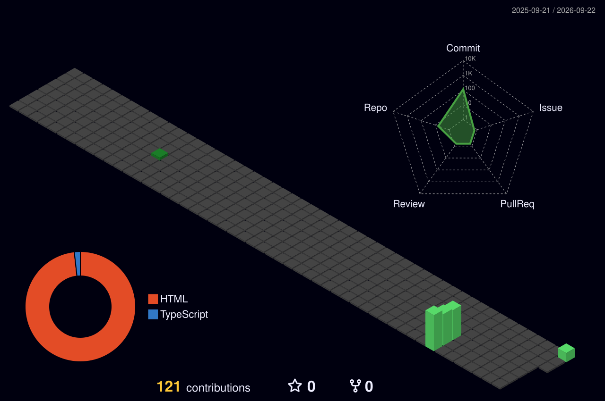

---

## 👋 About Me

I’m **Faria Islam**, a Junior Data Analyst based in Sheffield. I work with **SQL, Power BI, Excel and Python** to turn raw, inconsistent data into dependable reporting, practical dashboards and insight that people can use.

My portfolio reflects how I approach analysis in real work: understand the question, check the quality of the data, define the metric clearly, test the result and explain what it means without unnecessary complexity.

### 🔎 What I focus on

| 🧹 Data reliability | 📊 Reporting & BI | 💬 Business communication |
|---|---|---|
| Cleansing, validation, integrity checks and documented rules | KPI/MI reporting, Power Query, DAX, data modelling and dashboard design | Clear findings, stakeholder-friendly summaries and practical recommendations |

### 🧭 How I work

- **Start with the business question** before choosing a chart or technique.
- **Make data quality visible** instead of hiding assumptions.
- **Build reproducible analysis** with documented steps and reusable code.
- **Communicate the decision**, not only the calculation.

> 💡 I want every piece of analysis to answer three questions: **Can we trust it? What does it tell us? What should happen next?**

---

## 🚀 Featured Portfolio Projects

| Project | Business focus | Core tools | Status |
|---|---|---|---|
| [📊 **Operational KPI Dashboard**](https://github.com/fowziafaria1234-ops/operational-kpi-dashboard) | Refreshable KPI reporting, star-schema modelling and data-validation rules | Power BI, DAX, Power Query, Python, Excel | [🟢 Live dashboard](https://fowziafaria1234-ops.github.io/operational-kpi-dashboard/dashboard/) |
| [🏫 **NYC School Performance Analysis**](https://github.com/fowziafaria1234-ops/nyc-school-performance-analysis) | Borough-level MI reporting, cleansing and performance comparison | Python, Pandas, NumPy, Matplotlib, Seaborn | [🟢 Live dashboard](https://fowziafaria1234-ops.github.io/nyc-school-performance-analysis/dashboard/) |
| [🧠 Student Mental Health SQL Analysis](https://github.com/fowziafaria1234-ops/student-mental-health-sql-analysis) | Cohort analysis, reusable KPI views and privacy-aware reporting | SQL, SQLite, CTEs, joins, window functions | [🟢 Live dashboard](https://fowziafaria1234-ops.github.io/student-mental-health-sql-analysis/dashboard/) |
| 🎬 **Netflix Content Trends Analysis** | Feature engineering and year-on-year catalogue trends | Python, Pandas, Matplotlib, trend analysis | 🟡 Repository being prepared |

> **Portfolio note:** Where original training data could not be shared publicly, the project repository uses clearly labelled, seeded synthetic data so the analytical process remains transparent and reproducible.

---

## 🧰 Technical Toolkit

### 📌 Analytics capabilities

`Data cleansing` · `Data validation` · `Data quality` · `EDA` · `Statistical analysis` · `Hypothesis testing` · `KPI/MI reporting` · `Dashboard development` · `Data modelling` · `Requirements gathering` · `Stakeholder communication` · `GDPR awareness`

---

## 🏅 Certifications

| Certification | Issuer | Date | Verification |
|---|---|---:|---|
| **CompTIA DataAI (DY0-001)** | CompTIA | July 2026 | [Verification guidance](./CERTIFICATIONS.md#comptia-dataai) |
| **Microsoft Certified: Azure Data Fundamentals** | Microsoft | May 2026 | [Verify](https://learn.microsoft.com/en-in/users/shiulif-4374/credentials/certification/azure-data-fundamentals) |
| **Microsoft Certified: Azure AI Fundamentals** | Microsoft | May 2026 | [Verify](https://learn.microsoft.com/en-in/users/shiulif-4374/credentials/certification/azure-ai-fundamentals) |
| **IBM Data Fundamentals** | IBM SkillsBuild | May 2026 | [Verify](https://www.credly.com/badges/49c2ea0b-b6bd-4805-be45-6930b5393792) |
| **NCFE Level 2 Certificate in Data Analytics** | Netcom / NCFE | 2026 | Training credential |
| **Data Analyst Associate — Level 2** | Newto Training | 2026 | Training credential |

---

## 📈 GitHub Activity

### 🌐 Contribution Map

> 🌱 This portfolio is actively growing as I publish additional SQL, Python, Power BI and data-quality projects.

---

## 🎯 Current Focus

- 🔭 Publishing transparent, reproducible analysis projects
- 🧠 Strengthening advanced SQL, Power BI and data-governance capability
- ☁️ Expanding my Azure data and AI foundations
- 🤝 Exploring **Junior Data Analyst, Reporting Analyst, MI Analyst, BI Analyst and Data Quality Analyst** opportunities

### Data is useful when people can **trust it**, **understand it** and **act on it**.

**Thank you for visiting my portfolio.**

