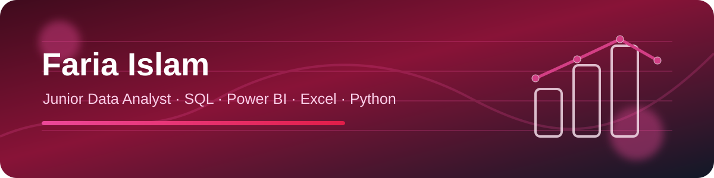
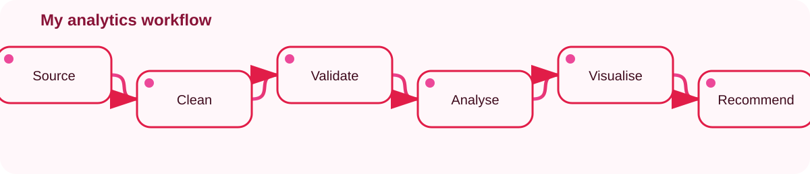
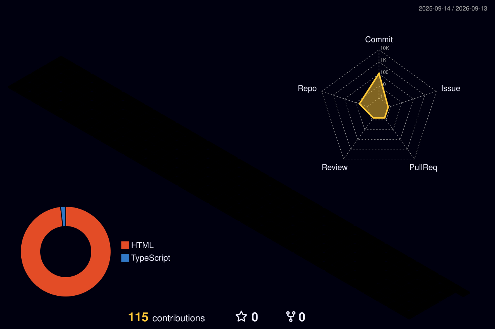

<div align="center">



<a href="https://git.io/typing-svg"></a>

[](https://www.linkedin.com/in/faria-islam-1a2338349)
[](mailto:fowziafaria1234@gmail.com)
[](https://fowziafaria1234-ops.github.io/fowziafaria1234-ops/)


</div>

---

## 🌹 About Me

```yaml
name: Faria Islam
role: Junior Data Analyst
location: Sheffield, United Kingdom
focus:
  - Data quality and validation
  - KPI and management-information reporting
  - Dashboard development and visual storytelling
core_stack: [SQL, Power BI, Excel, Python]
python_stack: [Pandas, NumPy, Matplotlib, Seaborn]
analytics: [EDA, Statistical Analysis, Hypothesis Testing, Data Modelling]
cloud_foundations: [Microsoft Azure Data Fundamentals, Azure AI Fundamentals]
working_style: "Curious, methodical, stakeholder-focused, and committed to reliable evidence"
career_goal: "Help teams make better decisions through trustworthy data and clear reporting"
```

I am a **Junior Data Analyst based in Sheffield** with project experience across operational reporting, education, student wellbeing, and entertainment data. I enjoy taking an untidy dataset through the full analysis lifecycle—**cleaning, validating, analysing, visualising, and communicating the business meaning**.

> 🌸 My portfolio is designed to show not just the final chart, but the thinking behind it: data-quality rules, reproducible code, metric definitions, stakeholder questions, and clear recommendations.



---

## ✨ Featured Portfolio Projects

| Project | Business focus | Tools | Live dashboard |
|---|---|---|---|
| [📊 Operational KPI Dashboard](https://github.com/fowziafaria1234-ops/operational-kpi-dashboard) | Refreshable KPI reporting, data modelling, validation rules | Power BI concepts, DAX, Power Query, Python, Excel | [Open](https://fowziafaria1234-ops.github.io/operational-kpi-dashboard/dashboard/) |
| [🏫 NYC School Performance Analysis](https://github.com/fowziafaria1234-ops/nyc-school-performance-analysis) | Borough-level MI reporting and data-quality investigation | Python, Pandas, NumPy, Matplotlib, Seaborn | [Open](https://fowziafaria1234-ops.github.io/nyc-school-performance-analysis/dashboard/) |
| [🧠 Student Mental Health SQL Analysis](https://github.com/fowziafaria1234-ops/student-mental-health-sql-analysis) | Cohort analysis, reusable KPI views, privacy-aware reporting | SQL, SQLite, CTEs, joins, window functions | [Open](https://fowziafaria1234-ops.github.io/student-mental-health-sql-analysis/dashboard/) |
| [🎬 Netflix Content Trends Analysis](https://github.com/fowziafaria1234-ops/netflix-content-trends-analysis) | Feature engineering and year-on-year content trends | Python, Pandas, Matplotlib, time-series analysis | [Open](https://fowziafaria1234-ops.github.io/netflix-content-trends-analysis/dashboard/) |

> **Transparency:** The original training datasets were not available for public release. These repositories are faithful portfolio reconstructions using seeded synthetic data, with the methods and capabilities described in my CV reproduced in a transparent, runnable format.

---

## 🧰 Technical Toolkit

<div align="center">


</div>

**Analytics capabilities:** Data cleansing · Data validation · Data quality · EDA · Statistical analysis · Hypothesis testing · KPI/MI reporting · Dashboard development · Data modelling · Requirements gathering · Stakeholder communication · GDPR awareness

---

## 🏅 Certifications

| Certification | Issuer | Date | Verification |
|---|---|---:|---|
| **CompTIA DataAI (DY0-001)** | CompTIA | July 2026 | [Verification guidance](./CERTIFICATIONS.md#comptia-dataai) |
| **Microsoft Certified: Azure Data Fundamentals** | Microsoft | May 2026 | [Verify](https://learn.microsoft.com/en-in/users/shiulif-4374/credentials/certification/azure-data-fundamentals) |
| **Microsoft Certified: Azure AI Fundamentals** | Microsoft | May 2026 | [Verify](https://learn.microsoft.com/en-in/users/shiulif-4374/credentials/certification/azure-ai-fundamentals) |
| **IBM Data Fundamentals** | IBM SkillsBuild | May 2026 | [Verify](https://www.credly.com/badges/49c2ea0b-b6bd-4805-be45-6930b5393792) |
| **NCFE Level 2 Certificate in Data Analytics** | Netcom / NCFE | 2026 | Training credential |
| **Data Analyst Associate — Level 2** | Newto Training | 2026 | Training credential |

---

## 📈 GitHub Activity

<div align="center">

### 🌸 3D Contribution Garden



</div>

> 🌱 This GitHub portfolio has recently been launched. Activity will continue to grow as new SQL, Python, Power BI and data-analysis projects are published.

---

## 🎯 Currently Building

- 🔭 Expanding my portfolio with transparent, reproducible analysis projects
- 🌱 Deepening my Power BI, SQL, Python, cloud-data, and data-governance skills
- 🤝 Open to **Junior Data Analyst, Reporting Analyst, MI Analyst, BI Analyst, and Data Quality Analyst** opportunities
- 💬 Happy to discuss data cleaning, KPI design, dashboard storytelling, and analytical problem-solving

<div align="center">


### 💗 Data becomes valuable when people can trust it, understand it, and act on it.

**Thanks for visiting my portfolio.**
</div>
